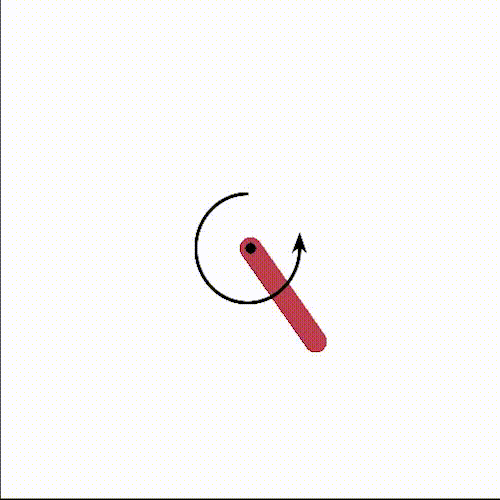

# Guaranteed Neural Network Control

This library implements different methods to prove specification of controllers of dynamical systems based on Neural Networks. We provide a DDPG implementation using TensorFlow that allows to train some agents on problem environments that should have a similar structure to OpenAI's Gym env structure. Feed-forward neural networks that model the controller and are implemented on TensorFlow with only monotonous activation functions can also be used to study the reachability set of the dynamical system. We provide example of both applications on concrete problems.

<!-- Mountain Car Reachability Proof | Pendulum Stability Proof -->
<p align="center">
  
</p>

## Examples
### Pendulum
<p align="center">


</p>

### Double integrator
<p align="center">


</p>

## Context

We consider a discrete-time closed-loop system that is operated by a deterministic controller which outputs the action at every iteration knowing the observation state of that system. Recent advances in Reinforcement Learning allow to represent such controller only using feed-forward neural networks and can solve complex problems with good generalization capabilities. The goal is therefore to guarantee the stability of these systems when the controller is a neural network. The code is provided with the article:.

## Usage guide

We implement an Interval object that allows to usefully manipulate intervals for the context of reachability analysis and also do basic arithmetic of intervals operations (summing, multiplying, dividing, taking the sinus of intervals...).

Here is a quick example of how to train a DDPG and analyze the reachability sets on a Gym problem.

Training the DDPG agent:

``` python
from guaranteed_control.ddpg.ddpg import DDPG
from guaranteed_control.ddpg.training import train, play
from guaranteed_control.intervals.interval import Interval
from guaranteed_control.problems.mountain_car import MountainCar

env = MountainCar()
input_interval = Interval(interval=[[-0.6, -0.4], [-0.07, 0.07]])
agent = DDPG(env.observation_space.shape[0], env.action_space.shape[0], upper_bounds=env.action_space.high, n_layer1=16, n_layer2=16, batch_size=16, noise_std=0.4, epsilon_s=0.05, lambda_smooth=0.2, D_s=10)
agent.start_training(env, agent, input_interval=input_interval, n_episodes=200)
```

Running the closed loop reachability analysis on 50 iterations

```python
from guaranteed_control.closed_loop.reachability_closed_loop import interval_approximation, interval_approximation_naive
from guaranteed_control.problems.dynamics import F_car

epsilon = 0.1
specification_interval = None
state_interval = Interval(interval=[[-0.48, -0.4795], [1, 1.001]])
state_intervals = interval_approximation(50, agent.actor, F_car, state_interval, None, epsilon, epsilon_actions=0.5, plot_jumps=1, plot=True, threshold=0.1, verbose=1)
```

More detailed explanations for each module are provided in every module inside the guaranteed_control folder.

## Parameter Calibration

The parameters passed to the interval_approximation function should be chosen depending on the system considered and the specifications it was trained to achieve. $\epsilon$ is the mistake that we want the neural network interval approximation not to exceed between the prediction and the simulated interval. The bigger it is, the bigger the over-approximation errors are, but the faster the algorithm should run. $\epsilon_{actions}$ is the upper bound the size of the predicted action interval should take in order to not divide the state intervals. More detailed explanations are given in the article.

The difficulty comes from the fact that $\epsilon$ and $\epsilon_actions$ are in competition: Imposing a big $\epsilon$ and a small $\epsilon_{actions}$ will just lead to an unnecessarily long run because the interval approximation will keep on dividing the state interval until it becomes small enough for reachMLP to not make a big enough mistake on the interval since the error is proportionate to the size of the interval.

A good practice calibration would be to start with a small $\epsilon$ and make the value $\epsilon_{actions}$ bigger but small enough to not apply big steps on the interval to avoid propagating different scenarios of the state interval in every component of it (ie. creating as many scenarios as necessary inside every iteration).

For more documentation on these parameters and how to use the corresponding function, go the module "sys_reachability" inside the guaranteed_control folder, or check the projects report pdf. 


